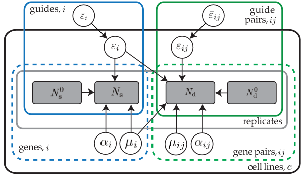

Hierarchical model
====================
Valinor implements a Bayesiam hierarchical model that partially-pools different observations of the CRISPR guide parameters across experiments and controls. It uses a negative-binomial distribution to describe the final counts, subject to an overdispersion parameter estimated from the experiment replicates. The structure of the parameter dependencies can be seen in the plate diagram below.

This is inferred using variational inference in NumPyro, assuming normal posterior distributions with a low-rank approximation of the covariance matrix.
